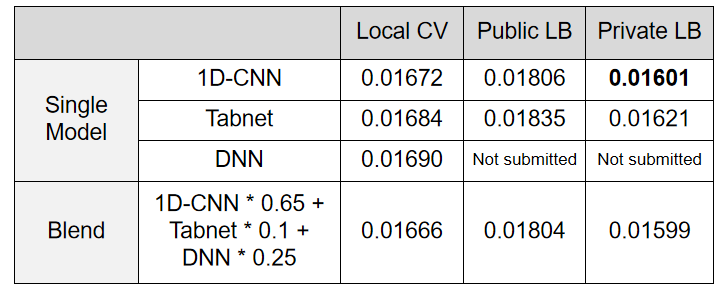
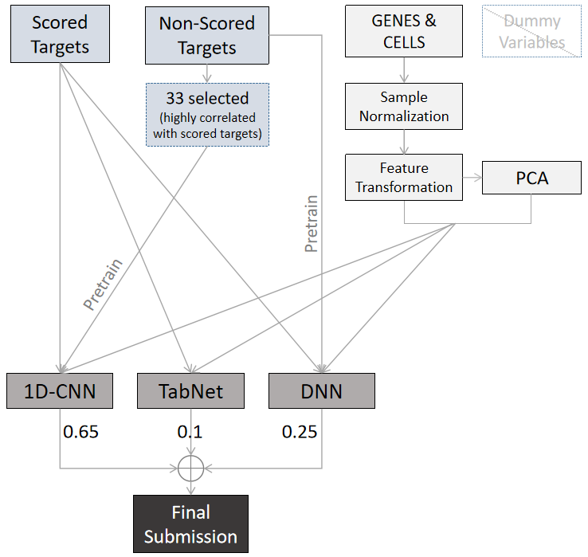

# Kaggle-MoA 2nd Place Solution

Below is my solution for the [Mechanisms of Action (MoA) Prediction competition](https://www.kaggle.com/c/lish-moa/). 

If you run into any trouble with the setup/code or have any questions please contact me at baosenguo@163.com.

##### Solution summary: https://www.kaggle.com/c/lish-moa/discussion/202256

## OVERVIEW

This approach consists of 3 single modes:

- 1D-CNN
- TabNet
- DNN

and the final submission is generated by weighted average of single models outputs.

The table below lists the performance of the single modes and the final blending in this scheme. 
The most important part of this scheme may be 1D-CNN, which has a performance of 0.01601 (private lb). The final blending only improves by 0.00002 on this basis (private lb 0.01599).

The flow chart below outlines the solution. 

## ARCHIVE CONTENTS

- training: notebooks for 3 single models training and model files generating.
  - 1d-cnn-train.ipynb: 1D-CNN
  - tabnet-train.ipynb: TabNet
  - dnn-train.ipynb: DNN

- inference: notebook for inference.
  - inference.ipynb: this script preprocess the input data,  make inference using 3 pre-trained models, and generate submission with blending. 

## HARDWARE

All step can be done by using kaggle notebook instance (with GPU for training and CPU for inference).

## SOFTWARE

python 3.7.6

numpy 1.18.5

pandas 1.1.3

torch 1.6.0

pytorch_tabnet 2.0.0

sklearn 0.23.2

## TRAINING

All the training and inference steps can be done within notebooks on kaggle platform.

(1) add moa dataset for each kernel.

(2) run 3 single model notebooks (1d-cnn-train.ipynb, tabnet-train.ipynb, dnn-train.ipynb ) for training and generating model files as outputs.

(3) add kernel outputs of single models to the inference notebook (inference.ipynb), copy file path and fill in the corresponding mod_path.

(4) run the inference notebook to generate final submission. 

